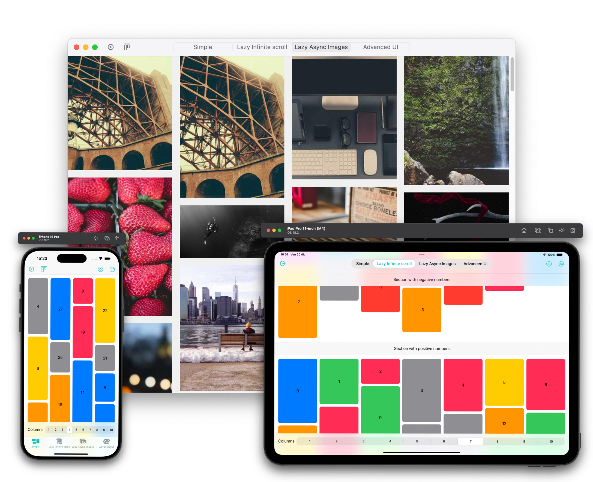
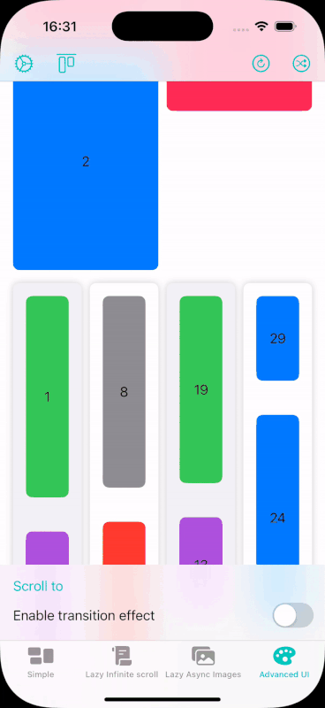
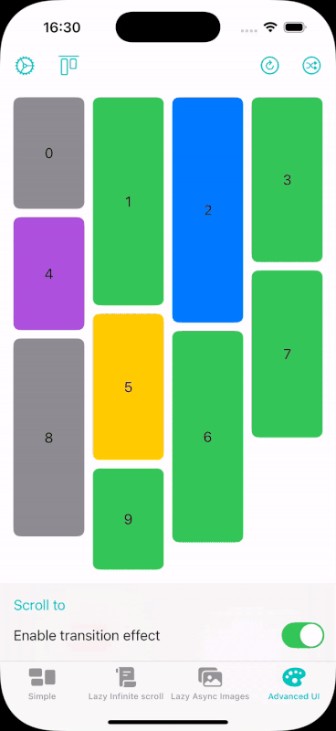

# Waterfall Grids

### Waterfall grid layout with lazy loading support for SwiftUI

<p>
  <a href="https://github.com/ricocrescenzio95/WaterfallGrids/releases">
    
  </a>
  <a href="https://swiftpackageindex.com/ricocrescenzio95/WaterfallGrids">
    
  </a>
  <a href="https://swiftpackageindex.com/ricocrescenzio95/WaterfallGrids">
    
  </a>
  <a href="https://saythanks.io/to/rico.crescenzio">
    
  </a>
  <a href="https://www.paypal.com/donate/?hosted_button_id=RWDBC8TS5CNVA">
    
  </a>
</p>

<p align="center">

</p>

## Features

- Lazy and non-lazy loading
- Vertical and horizontal arrangement
- Programmatic scroll
- All SwiftUI animations
- Support scroll view system modifiers such as `scrollTargetLayout`, `scrollTargetBehavior`, `scrollTransition` and so on
- Section header and footer

| Items roerder | Custom scroll paging and transitions |
| --- | --- |
|  |  |


## Installation

`WaterfallGrids` can be installed using Swift Package Manager.

1. In Xcode open **File/Swift Packages/Add Package Dependency...** menu.

2. Copy and paste the package URL:

```
https://github.com/ricocrescenzio95/WaterfallGrids
```

For more details refer to [Adding Package Dependencies to Your App](https://developer.apple.com/documentation/xcode/adding_package_dependencies_to_your_app) documentation.

## Usage

In general `WaterfallGrid` or `LazyWaterfallGrid` APIs are very similar to other SwiftUI views like `LazyVGrid` and `ForEach`; both views have same initializers, allowing to easily switch between eager and lazy version.

```swift
WaterfallGrid(
	items: .columns([.init(), .init(alignment: .trailing, spacing: 10)]),
	spacing: 20,
	data: [0, 1, 2, 3, 4, 5, 6, 8, 9, 10],
	id: \.self
) { item in
	ItemView(item: item)
}

```

- `items` can be either `rows()` or `column()`, passing an array of `WaterfallItems.Row` or `WaterfallItems.Column` to specify how to arrange rows or columns; `alignment` and `spacing` allows to customize position and spacing of each view in a column/row
- `spacing` specify the distance between columns or rows
- `data` the collection of items to be showed in the grid
- `id` the keypath to identify which property of each element is the id. For `Identifiable` elements, this is inferred.
- content: a closure that returns a view for each element of `data`.


For advanced usages, please refer to the full Documentation.

## Documentation

Use Apple `DocC` generated documentation, from Xcode, `Product > Build Documentation`.


## Found a bug or want new feature?

If you found a bug, you can open an issue as a bug [here](https://github.com/ricocrescenzio95/WaterfallGrids/issues/new?assignees=ricocrescenzio95&labels=bug&template=bug_report.md&title=%5BBUG%5D)

Want a new feature? Open an issue [here](https://github.com/ricocrescenzio95/WaterfallGrids/issues/new?assignees=ricocrescenzio95&labels=enhancement&template=feature_request.md&title=%5BNEW%5D)

### You can also open your own PR and contribute to the project! [Contributing](CONTRIBUTING.md) 🤝

## License

This software is provided under the [MIT](LICENSE.md) license